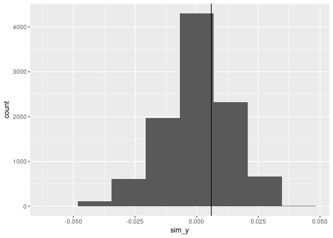

<!-- README.md is generated from README.Rmd. Please edit that file -->

# long

<!-- badges: start -->

[](https://lifecycle.r-lib.org/articles/stages.html#experimental)
<!-- badges: end -->

The goal of long is to …

## Installation

You can install the development version of long from
[GitHub](https://github.com/) with:

``` r
# install.packages("devtools")
devtools::install_github("beanumber/long")
```

## Boston Police citations

``` r
library(tidyverse)
library(long)
```

The following table displays summary statistics for the citation data in
the `boston_pd_1120` data frame.

``` r
boston_pd_1120 |>
  group_by(issuing_agency) |>
  summarize(
    num_citations = n(),
    begin_date = min(event_date),
    end_date = max(event_date),
    num_officers = n_distinct(officer_id),
    num_offenses = n_distinct(offense)
  ) |>
  knitr::kable()
```

| issuing_agency              | num_citations | begin_date | end_date   | num_officers | num_offenses |
|:----------------------------|--------------:|:-----------|:-----------|-------------:|-------------:|
| Boston Police Area A        |         20845 | 2011-01-01 | 2020-11-01 |          902 |          179 |
| Boston Police Area B        |         34368 | 2011-01-01 | 2020-12-24 |         1163 |          183 |
| Boston Police Area C        |         18666 | 2011-01-01 | 2020-12-28 |          922 |          173 |
| Boston Police Area D        |         15615 | 2011-01-01 | 2020-11-27 |          798 |          141 |
| Boston Police Area E        |         10133 | 2011-01-02 | 2020-03-09 |          522 |          127 |
| Boston Police Area F        |          7728 | 2011-01-02 | 2020-12-07 |          556 |          139 |
| Boston Police Area G        |          8663 | 2011-01-01 | 2020-08-16 |          434 |          133 |
| Boston Police Area H        |         33496 | 2011-01-01 | 2020-12-18 |          936 |          166 |
| Boston Police Area J        |         12390 | 2011-01-02 | 2020-10-19 |          545 |          126 |
| Boston Police Area K        |         12715 | 2011-01-01 | 2020-10-10 |          438 |          126 |
| Boston Police Area L        |          9067 | 2011-01-01 | 2020-09-09 |          522 |          137 |
| Boston Police District A-1  |          4613 | 2011-09-10 | 2020-12-30 |          512 |          137 |
| Boston Police District A-7  |          3373 | 2012-01-01 | 2020-12-10 |          293 |          108 |
| Boston Police District B-2  |          9201 | 2012-01-07 | 2021-01-01 |          834 |          151 |
| Boston Police District B-3  |          6860 | 2011-04-03 | 2021-01-01 |          672 |          140 |
| Boston Police District C-11 |          9610 | 2011-06-01 | 2020-12-31 |          632 |          142 |
| Boston Police District C-6  |          6274 | 2011-08-21 | 2020-12-31 |          585 |          114 |
| Boston Police District D-14 |          2229 | 2011-01-04 | 2020-12-30 |          322 |          103 |
| Boston Police District D-4  |          6197 | 2011-09-16 | 2021-01-01 |          798 |          138 |
| Boston Police District E-13 |          3477 | 2013-05-23 | 2020-12-31 |          331 |           96 |
| Boston Police District E-18 |          7011 | 2011-05-08 | 2021-01-01 |          540 |          120 |
| Boston Police District E-5  |          7572 | 2012-04-12 | 2021-01-01 |          532 |           96 |
| Boston Police Special OPS   |         78038 | 2011-01-01 | 2021-01-01 |         2067 |          262 |

## Weighted disparity

``` r
obj <- weighted_disparity(long::cites_sp, 4131)
obj[-3]
#> [[1]]
#> [1] 0.005924856
#> 
#> [[2]]
#> [1] 0.6511
#> 
#> [[3]]
#> # A tibble: 18 × 6
#>    Location.Name    n1    n2      p1     p2    y_piece
#>    <chr>         <int> <int>   <dbl>  <dbl>      <dbl>
#>  1 Ashfield         28     1 0       0       0        
#>  2 Athol           638     4 0.0408  0       0.000508 
#>  3 Bernardston     513    22 0.0741  0.0455  0.00196  
#>  4 Buckland         24     1 0       0       0        
#>  5 Colrain          14     1 0       0       0        
#>  6 Deerfield      2501   194 0.0672  0.0567  0.00633  
#>  7 Erving           93     2 0.0108  0       0.0000670
#>  8 Gill            172     4 0.0233  0       0.000290 
#>  9 Greenfield     2438    73 0.0595  0.0548  0.00106  
#> 10 Heath             4     1 0       0       0        
#> 11 Hubbardston      10     1 0       0       0        
#> 12 Northampton    1707     1 0.0955  0       0.000297 
#> 13 Orange          252     2 0.0516  0       0.000321 
#> 14 Phillipston    1196     2 0.0426  0       0.000266 
#> 15 Rutland          25     1 0       0       0        
#> 16 Shelburne       241     6 0.00830 0       0.000155 
#> 17 Templeton      3663     3 0.0511  0.333  -0.00264  
#> 18 Whately         981     2 0.0673  0.5    -0.00270  
#> 
#> [[4]]
```


