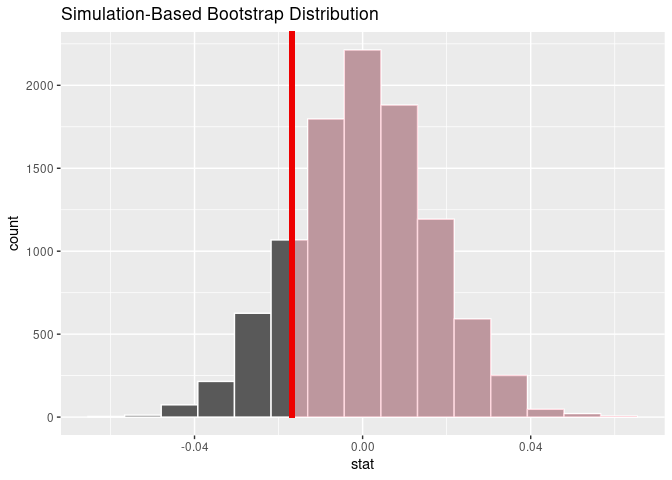

<!-- README.md is generated from README.Rmd. Please edit that file -->

# comvlong

<!-- badges: start -->

[](https://lifecycle.r-lib.org/articles/stages.html#experimental)
<!-- badges: end -->

The goal of long is to …

[Commonwealth v.
Long](https://law.justia.com/cases/massachusetts/supreme-court/2020/sjc-12868.html)

## Installation

You can install the development version of comvlong from
[GitHub](https://github.com/) with:

``` r
# install.packages("remotes")
remotes::install_github("beanumber/comvlong")
```

## Boston Police citations

``` r
library(tidyverse)
library(comvlong)
```

The following table displays summary statistics for the citation data in
the `bpd_offenses_20` data frame.

``` r
bpd_offenses_20 |>
  group_by(issuing_agency) |>
  summarize(
    num_citations = n(),
    begin_date = min(event_date),
    end_date = max(event_date),
    num_officers = n_distinct(officer_id),
    num_offenses = n_distinct(offense)
  ) |>
  knitr::kable()
```

| issuing_agency              | num_citations | begin_date | end_date   | num_officers | num_offenses |
|:----------------------------|--------------:|:-----------|:-----------|-------------:|-------------:|
| Boston Police Area A        |            52 | 2020-01-02 | 2020-11-01 |            1 |           22 |
| Boston Police Area B        |           231 | 2020-01-01 | 2020-12-24 |            1 |           34 |
| Boston Police Area C        |           152 | 2020-01-01 | 2020-12-28 |            1 |           27 |
| Boston Police Area D        |            58 | 2020-01-01 | 2020-11-27 |            1 |           22 |
| Boston Police Area E        |             1 | 2020-03-09 | 2020-03-09 |            1 |            1 |
| Boston Police Area F        |            38 | 2020-01-03 | 2020-12-07 |            1 |           15 |
| Boston Police Area G        |             3 | 2020-07-02 | 2020-08-16 |            1 |            3 |
| Boston Police Area H        |            69 | 2020-01-01 | 2020-12-18 |            1 |           20 |
| Boston Police Area J        |            31 | 2020-01-04 | 2020-10-19 |            1 |           16 |
| Boston Police Area K        |            25 | 2020-01-01 | 2020-10-10 |            1 |           15 |
| Boston Police Area L        |             8 | 2020-08-07 | 2020-09-09 |            1 |            4 |
| Boston Police District A-1  |          1267 | 2020-01-01 | 2020-12-30 |          280 |           80 |
| Boston Police District A-7  |          1942 | 2020-01-01 | 2020-12-10 |          198 |           75 |
| Boston Police District B-2  |          5625 | 2020-01-01 | 2020-12-31 |          572 |          103 |
| Boston Police District B-3  |          4237 | 2020-01-01 | 2020-12-31 |          452 |          110 |
| Boston Police District C-11 |          4651 | 2020-01-01 | 2020-12-31 |          407 |           91 |
| Boston Police District C-6  |          4446 | 2020-01-01 | 2020-12-31 |          433 |           85 |
| Boston Police District D-14 |          1128 | 2020-01-03 | 2020-12-30 |          190 |           55 |
| Boston Police District D-4  |          3848 | 2020-01-01 | 2020-12-31 |          554 |          100 |
| Boston Police District E-13 |          2293 | 2020-01-01 | 2020-12-31 |          236 |           76 |
| Boston Police District E-18 |          5362 | 2020-01-01 | 2020-12-31 |          395 |           99 |
| Boston Police District E-5  |          5727 | 2020-01-01 | 2020-12-31 |          395 |           77 |
| Boston Police Special OPS   |          1799 | 2020-01-01 | 2020-12-27 |          256 |           92 |

## Weighted disparity

``` r
sims <- simulate_officer_citations(
  n_sims = 10000, 
  my_officer_id = 9047, 
  race_of_interest = "BLACK"
)
y_hat <- observe_officer()
y_hat
#> [1] -0.01679358
p_value_officer(sims, y_hat)
#> # A tibble: 1 × 1
#>   p_value
#>     <dbl>
#> 1   0.841
visualize_weighted_disparity(sims, y_hat)
```


