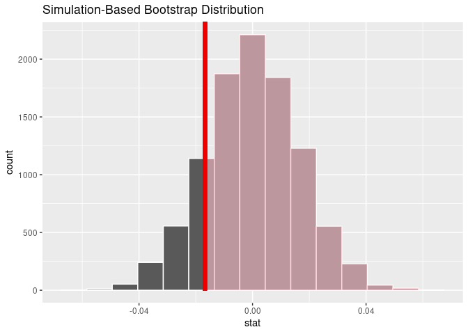

<!-- README.md is generated from README.Rmd. Please edit that file -->

# comvlong

<!-- badges: start -->

[](https://lifecycle.r-lib.org/articles/stages.html#experimental)
[](https://github.com/beanumber/comvlong/actions/workflows/R-CMD-check.yaml)
<!-- badges: end -->

The goal of **comvlong** is to facilitate the computation of a
**weighted disparity metric** for police officers, which could be used
in criminal proceedings under the guidance provided by the Massachusetts
Supreme Judicial Court in [*Commonwealth v.
Long*](https://law.justia.com/cases/massachusetts/supreme-court/2020/sjc-12868.html).
Please see VanDerwerken, Fowler, and Kadane (2023) for more information.

## Installation

You can install the development version of **comvlong** from
[GitHub](https://github.com/) with:

``` r
# install.packages("remotes")
remotes::install_github("beanumber/comvlong")
```

## Boston Police Department citations

``` r
library(tidyverse)
library(comvlong)
```

In March 2021, attorney Joshua Raisler Cohn of the [Roxbury Defenders
Unit](https://www.publiccounsel.net/dir/roxbury-dist-pd/) made a public
records request to the Boston Police Department for 10 years’ worth of
citation data. These data were included in [The Woke Windows
Project](https://www.wokewindows.org/) and in [`nstory`’s GitHub
repository](https://github.com/nstory/boston_pd_citations).

The `comvlong` package contains:

- `download_bpd_offenses()`: a function to download the full 10-year
  dataset
- `bpd_offenses_20`: a complete set of offenses for only the year 2020
- `bpd_stops_1120`: a cleaned set of 10 years worth of *stops*
  (aggregated from the offenses)
- several ancillary tables

The following table displays summary statistics for the citation data in
the `bpd_offenses_20` data frame.

``` r
bpd_offenses_20 |>
  group_by(issuing_agency) |>
  summarize(
    num_citations = n(),
    begin_date = min(event_date),
    end_date = max(event_date),
    num_officers = n_distinct(officer_id),
    num_offenses = n_distinct(offense)
  ) |>
  knitr::kable()
```

| issuing_agency              | num_citations | begin_date | end_date   | num_officers | num_offenses |
|:----------------------------|--------------:|:-----------|:-----------|-------------:|-------------:|
| Boston Police Area A        |            52 | 2020-01-02 | 2020-11-01 |            1 |           22 |
| Boston Police Area B        |           231 | 2020-01-01 | 2020-12-24 |            1 |           34 |
| Boston Police Area C        |           152 | 2020-01-01 | 2020-12-28 |            1 |           27 |
| Boston Police Area D        |            58 | 2020-01-01 | 2020-11-27 |            1 |           22 |
| Boston Police Area E        |             1 | 2020-03-09 | 2020-03-09 |            1 |            1 |
| Boston Police Area F        |            38 | 2020-01-03 | 2020-12-07 |            1 |           15 |
| Boston Police Area G        |             3 | 2020-07-02 | 2020-08-16 |            1 |            3 |
| Boston Police Area H        |            69 | 2020-01-01 | 2020-12-18 |            1 |           20 |
| Boston Police Area J        |            31 | 2020-01-04 | 2020-10-19 |            1 |           16 |
| Boston Police Area K        |            25 | 2020-01-01 | 2020-10-10 |            1 |           15 |
| Boston Police Area L        |             8 | 2020-08-07 | 2020-09-09 |            1 |            4 |
| Boston Police District A-1  |          1267 | 2020-01-01 | 2020-12-30 |          280 |           80 |
| Boston Police District A-7  |          1942 | 2020-01-01 | 2020-12-10 |          198 |           75 |
| Boston Police District B-2  |          5625 | 2020-01-01 | 2020-12-31 |          572 |          103 |
| Boston Police District B-3  |          4237 | 2020-01-01 | 2020-12-31 |          452 |          110 |
| Boston Police District C-11 |          4651 | 2020-01-01 | 2020-12-31 |          407 |           91 |
| Boston Police District C-6  |          4446 | 2020-01-01 | 2020-12-31 |          433 |           85 |
| Boston Police District D-14 |          1128 | 2020-01-03 | 2020-12-30 |          190 |           55 |
| Boston Police District D-4  |          3848 | 2020-01-01 | 2020-12-31 |          554 |          100 |
| Boston Police District E-13 |          2293 | 2020-01-01 | 2020-12-31 |          236 |           76 |
| Boston Police District E-18 |          5362 | 2020-01-01 | 2020-12-31 |          395 |           99 |
| Boston Police District E-5  |          5727 | 2020-01-01 | 2020-12-31 |          395 |           77 |
| Boston Police Special OPS   |          1799 | 2020-01-01 | 2020-12-27 |          256 |           92 |

The table below shows the first few rows of the `bpd_stops_1120` table.

``` r
bpd_stops_1120
#> # A tibble: 240,092 × 6
#> # Groups:   citation_number, officer_id, event_date, location_name [240,092]
#>    citation_number officer_id event_date          location_name race  
#>    <chr>           <chr>      <dttm>              <chr>         <chr> 
#>  1 019891AA        99877      2018-02-10 00:00:00 Dorchester    BLACK 
#>  2 019892AA        99877      2018-02-10 00:00:00 Dorchester    BLACK 
#>  3 019893AA        99877      2018-02-10 00:00:00 Dorchester    BLACK 
#>  4 019895AA        99877      2018-02-10 00:00:00 Dorchester    HISP  
#>  5 019896AA        99877      2018-02-10 00:00:00 Dorchester    BLACK 
#>  6 019899AA        99877      2018-02-10 00:00:00 Dorchester    BLACK 
#>  7 019901AA        99877      2018-02-10 00:00:00 Dorchester    HISP  
#>  8 020114AA        4159       2018-02-11 00:00:00 Roxbury       BLACK 
#>  9 020270AA        131215     2018-02-10 00:00:00 Boston        UNKNWN
#> 10 020630AA        99877      2018-02-12 00:00:00 Dorchester    WHITE 
#> # ℹ 240,082 more rows
#> # ℹ 1 more variable: num_offenses <int>
```

While the Boston Police Department can be used for many purposes, our
goal is to use these to illustrate how the **weighted disparity
measure** can be used in court proceedings to support a claim of racial
bias against an individual police officer.

## Weighted disparity

Let $n_{ij}$ be the number of stops made by officer $i \in I$ in
location $j$, over some duration of time, and let $p_{ij}(r)$ be the
proportion of those $n_{ij}$ stops in which the person who was stopped
was identified as having race $r$. The goal of the **weighted disparity
measure** is to contextualize the proportion $p_{ij}(r)$ in relation to
officer $i$’s peers. More specifically, if it were officer $i$’s peers
(in the set $I$) who had made those $n_{ij}$ stops in the same locations
during the same periods of time, what proportion of those stops would
likely be of people whose race is identified as $r$?

Since officer $i$’s patrol locations vary, as do the demographics of
each location $j$, we define $w_{ij}$ to be a *weight* – the proportion
of stops made by officer $i$ in each location $j$: $$
  w_{ij} = \frac{n_{ij}}{\sum_{j \in J} n_{ij}}, 
$$ where $J$ is the set of all locations. Note that
$\sum_{j \in J} w_{ij} = 1$.

Then for all officers **other than** officer $i$ patrolling location
$j$, they stop people of race $r$ as: $$
  p_{ij}^*(r) = \sum_{k \neq i, k \in I} \frac{n_{kj}(r)}{n_{kj}} \,,
$$ The difference $d_{ij}(r) = p_{ij}(r) - p_{ij}^*(r)$ is the
*disparity* between the behavior of officer $i$ relative to the other
officers who patrol location $j$, with respect to race $r$. If
$d_{ij}(r) > 0$, then officer $i$ has stopped people of race $r$ in
location $j$ more often than his peers.

The weighted disparity measure $x_{ij}(r)$ is the weighted average of
officer $i$’s disparity measures across all locations:

$$
  x_{ij}(r) = \sum_{j \in J} w_{ij} \cdot d_{ij}(r) \,.
$$ A positive weighted disparity measure implies that officer $i$
stopped people of $r$ more often than his peers, after controlling for
the locations of the stops.

### Inference

An individual weighted disparity measure can be contextualize under a
simulated null distribution. If officer $i$ exhibited the same behavior
as his peers, then we would expect him to stop people of race $r$ in the
same proportion as his peers, after controlling for location. Thus, our
null hypothesis is that $p_{ij}(r) = p_{ij}^*(r)$, and therefore: $$
  \mathbb{E}[x_{ij}(r)] = 0 \,.
$$ We simulate a null distribution for $w_{ij}(r)$ by taking $n_{ij}$
random draws from a binomial distribution with proportion $p_{ij}^*(r)$
for each $j \in J$, and computing the resulting simulated weighted
disparity measure as above. This null distribution is centered at 0, the
hypothesized mean disparity. A one-side test with a small p-value
provides evidence against the null hypothesis that officer $i$’s
behavior is indistinguishable from that of his peers.

### Example

Consider officer 9047.

``` r
stops_9047 <- summarize_officer_citations(my_officer_id = 9047)
stops_9047
#> # A tibble: 8 × 9
#>   location_name   n_0     n cites_0 cites    p_0 p_hat   alpha disparity
#>   <chr>         <int> <int>   <int> <int>  <dbl> <dbl>   <dbl>     <dbl>
#> 1 Boston        46018   248    9468    59 0.206  0.238 0.315    0.0101  
#> 2 Brighton       4609     4     531     0 0.115  0     0.00508 -0.000586
#> 3 Charlestown     836    22      78     4 0.0933 0.182 0.0280   0.00247 
#> 4 Dorchester    49605    81   25856    39 0.521  0.481 0.103   -0.00409 
#> 5 E Boston         76     5       4     0 0.0526 0     0.00635 -0.000334
#> 6 Roxbury       43297   343   18617   126 0.430  0.367 0.436   -0.0273  
#> 7 S Boston      10168    30    1843     3 0.181  0.1   0.0381  -0.00310 
#> 8 W Roxbury     17537    54    6259    24 0.357  0.444 0.0686   0.00601
sum(stops_9047$n)
#> [1] 787
```

According to the data, he made a total 787 stops across 8 towns.
Although he stopped drivers identified as `BLACK` at higher rates than
his colleagues in Boston, Charlestown, and West Roxbury, he stopped
drivers identified as `BLACK` at lower rates in other towns.

Officer 9047’s weighted disparity measure is below zero, indicating that
he did not stop `BLACK` drivers as often as his colleagues, after
controlling for location.

``` r
x_ij_BLACK <- observe_officer()
x_ij_BLACK
#> [1] -0.01679358
```

To build a null distribution for the hypothesis that officer 9047 is no
different than his colleagues, we use the `simulate_officer_citations()`
function.

``` r
sims <- simulate_officer_citations(
  n_sims = 10000, 
  my_officer_id = 9047, 
  race_of_interest = "BLACK"
)
```

We can then compute a p-value.

``` r
p_value_officer(sims, x_ij_BLACK)
#> # A tibble: 1 × 1
#>   p_value
#>     <dbl>
#> 1   0.843
visualize_weighted_disparity(sims, x_ij_BLACK)
```



## References

<div id="refs" class="references csl-bib-body hanging-indent">

<div id="ref-vanderwerken2023" class="csl-entry">

VanDerwerken, Douglas N., Mary Fowler, and Joseph B. Kadane. 2023.
“Making the Case of Racial Profiling: Opportunities for Statisticians in
Legal Statistics.” *To Be Submitted*, 1–12.

</div>

</div>
